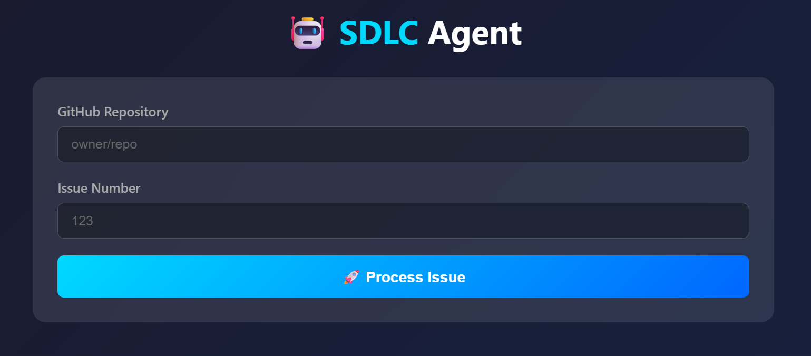
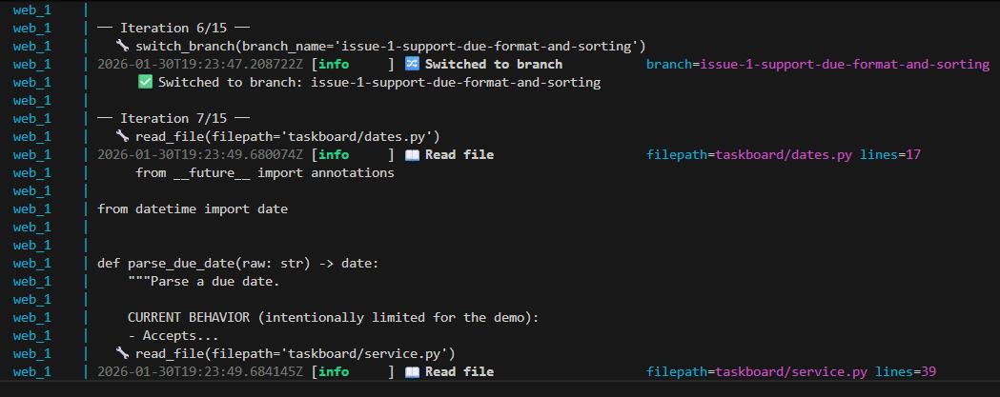
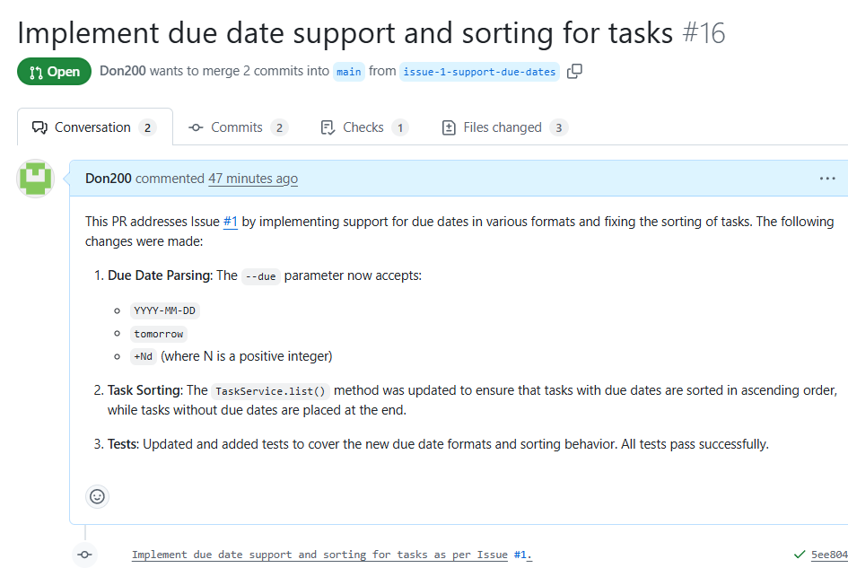
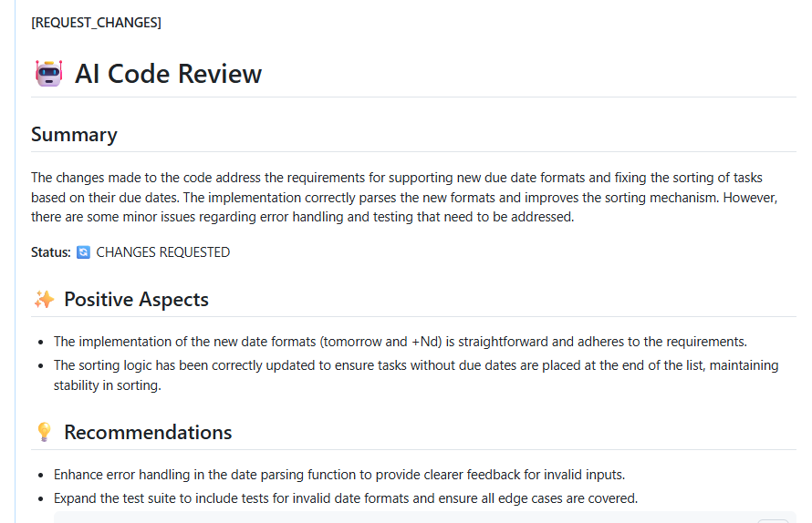
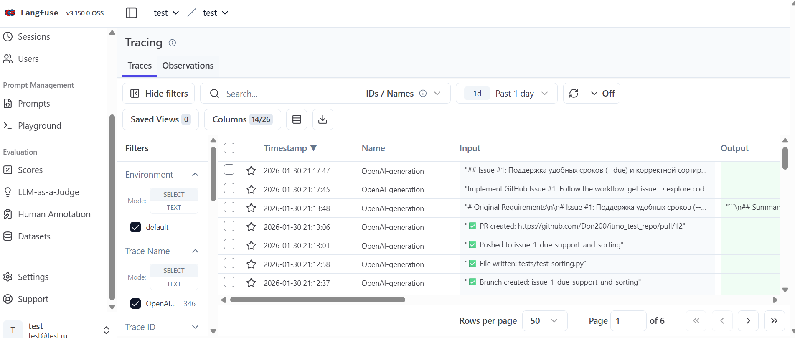

# SDLC Agent

Автономный агент для автоматизации разработки в GitHub. Получает задачу из Issue, пишет код, создаёт PR, анализирует результаты CI и итеративно исправляет ошибки до успешного прохождения всех проверок.
- **ссылка на репозиторий для теста** - https://github.com/Don200/itmo_test_repo 
- **ссылка на сервис** - http://89.124.64.122:8000/



## Возможности

### Полный цикл разработки
Агент выполняет весь цикл от задачи до готового PR:
- Парсит описание Issue и формирует план
- Анализирует структуру проекта
- Пишет код с учётом существующего стиля
- Создаёт ветку, коммитит, открывает PR
- Ждёт результаты CI и анализирует логи при ошибках
- Самостоятельно исправляет проблемы и повторяет цикл

### AI Code Review
Отдельный агент-ревьюер проверяет качество кода:
- Анализирует diff на предмет ошибок и уязвимостей
- Оценивает соответствие задаче из Issue
- Оставляет комментарии в PR
- Формирует рекомендации по исправлению

### Observability через Langfuse
Все вызовы LLM логируются в Langfuse:
- Трейсинг цепочек запросов
- Статистика по токенам и latency
- Просмотр промптов и ответов
- Анализ стоимости

Подключение опционально — достаточно указать ключи в переменных окружения.

### Web-интерфейс
Встроенный UI для запуска агента из браузера:
- Форма для указания репозитория и номера Issue
- Real-time отображение логов выполнения
- Статус текущей задачи
- Ссылка на созданный PR

Запуск: `sdlc-agent web` или `docker compose up web`

### Гибкая конфигурация LLM
Поддержка любого OpenAI-совместимого API:
- OpenAI (GPT-4, GPT-4o, GPT-4o-mini)
- Azure OpenAI
- Локальные модели через Ollama, vLLM, LM Studio
- Любой сервис с OpenAI-совместимым эндпоинтом

### Stateful агент
Агент сохраняет контекст между итерациями исправлений:
- История сообщений не теряется
- При фиксе CI-ошибок агент помнит что делал раньше
- Не создаёт дублирующие ветки и PR

## Демонстрация

### Логи выполнения


### Результат в GitHub


### AI Code Review


### Трейсинг в Langfuse


## Архитектура

```
┌─────────────────────────────────────────────────────────────┐
│                        Web UI / CLI                         │
└─────────────────────────────┬───────────────────────────────┘
                              │
          ┌───────────────────┼───────────────────┐
          ▼                   ▼                   ▼
   ┌─────────────┐    ┌─────────────┐    ┌─────────────┐
   │ Code Agent  │    │  Reviewer   │    │  LLM        │
   │             │    │   Agent     │    │  Gateway    │
   └──────┬──────┘    └──────┬──────┘    └──────┬──────┘
          │                  │                  │
          │    ┌─────────────┴─────────────┐    │
          │    │                           │    │
          ▼    ▼                           ▼    ▼
   ┌─────────────────┐              ┌─────────────────┐
   │  GitHub Client  │              │    Langfuse     │
   │  (Issues, PRs,  │              │   (Tracing)     │
   │   CI, Files)    │              │                 │
   └─────────────────┘              └─────────────────┘
```

### Инструменты агента
Агент использует 9 инструментов для работы:

| Инструмент | Назначение |
|------------|------------|
| `get_issue` | Получить описание задачи |
| `list_files` | Просмотр структуры проекта |
| `read_file` | Чтение файлов |
| `write_file` | Создание/изменение файлов |
| `create_branch` | Создание ветки |
| `switch_branch` | Переключение на существующую ветку |
| `commit_and_push` | Коммит и пуш изменений |
| `create_pull_request` | Создание PR |
| `get_ci_logs` | Получение логов CI для анализа ошибок |
| `finish` | Завершение задачи |

## Установка и запуск

### Через Docker (рекомендуется)

```bash
# Склонировать репозиторий
git clone <repo>
cd sdlc-agent

# Настроить переменные
cp .env.example .env
# Заполнить GITHUB_TOKEN, OPENAI_API_KEY

# Запустить веб-интерфейс
docker compose up web

# Или обработать конкретный Issue
docker compose run --rm agent process 42
```

### Локальная установка

```bash
pip install -e ".[dev]"

# CLI
sdlc-agent process 42
sdlc-agent run-cycle 42
sdlc-agent web
```

## Конфигурация

| Переменная | Описание | По умолчанию |
|------------|----------|--------------|
| `GITHUB_TOKEN` | Токен с доступом к репозиторию | — |
| `GITHUB_REPOSITORY` | Репозиторий (owner/repo) | — |
| `OPENAI_API_KEY` | API ключ | — |
| `OPENAI_MODEL` | Модель | gpt-4o-mini |
| `OPENAI_BASE_URL` | Кастомный endpoint | — |
| `MAX_ITERATIONS` | Лимит итераций автофикса | 5 |
| `LANGFUSE_PUBLIC_KEY` | Ключ Langfuse | — |
| `LANGFUSE_SECRET_KEY` | Секрет Langfuse | — |
| `LANGFUSE_BASE_URL` | URL Langfuse | cloud |

## Стек

- **Python 3.11+**
- **LangChain** — оркестрация агента и tool calling
- **FastAPI** — веб-интерфейс
- **PyGithub** — работа с GitHub API
- **GitPython** — git-операции
- **Langfuse** — observability
- **structlog** — логирование
- **Docker** — контейнеризация

## Разработка

```bash
# Тесты
pytest tests/ -v

# Линтеры
ruff check src/
black src/
mypy src/

# Через Docker
docker compose run --rm test
docker compose run --rm lint
```

## Лицензия

MIT
